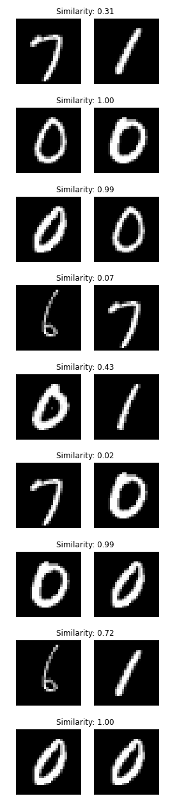

# Siamese Networks

Make Predictions with Siamese Network



```
.
├── README.md
├── examples
│   ├── image_01.png
│   ├── image_02.png
│   ├── image_03.png
│   ├── image_04.png
│   ├── image_05.png
│   ├── image_06.png
│   ├── image_07.png
│   ├── image_08.png
│   ├── image_09.png
│   ├── image_10.png
│   ├── image_11.png
│   ├── image_12.png
│   └── image_13.png
├── main.ipynb
├── output
│   ├── plot.png
│   └── siamese_model
│       ├── assets
│       ├── saved_model.pb
│       └── variables
│           ├── variables.data-00000-of-00001
│           └── variables.index
├── requirements.txt
├── submodules
│   ├── __pycache__
│   │   └── config.cpython-39.pyc
│   ├── config.py # Contains important configurations, including the path to our trained/serialized siamese network model residing on disk
│   ├── siamese_network.py # The Keras/TensorFlow function used to load our trained siamese network from disk
│   └── utils.py # Contains the euclidean_distance function utilized in our Lambda layer of the siamese network — we need to import this package to suppress any UserWarnings about loading Lambda layers from disk
├── test.py  # take trained model and sample of images to compare
└── train.py

```